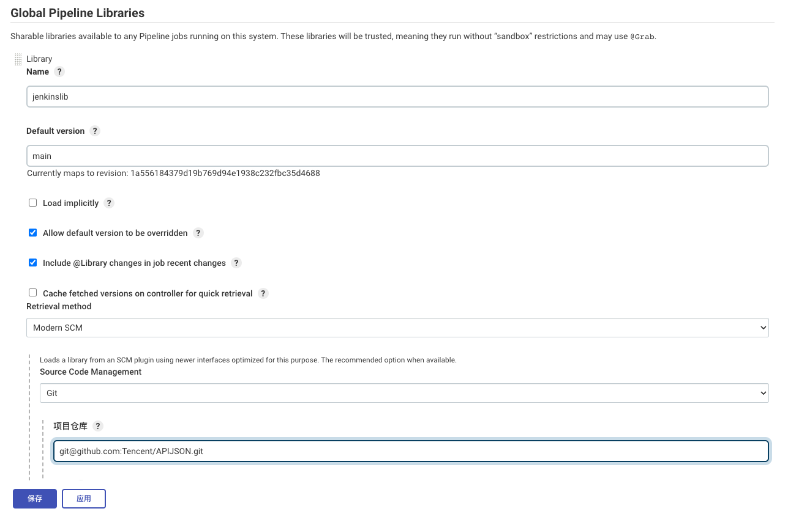

## Jenkins中添加Jenkins Lib库函数

- Manage Jenkins => Configure System => Global Pipeline Libraries
- Library Name => 定义库函数名称,如jenkinslib
- Default Version => 默认版本,我这里写的是main分支
- Source Code Management => 选择代码源(Git/Github/Subversion) 
- Repo => 填写代码仓库(这里我随意写的github的一个仓库,请自行修改)
